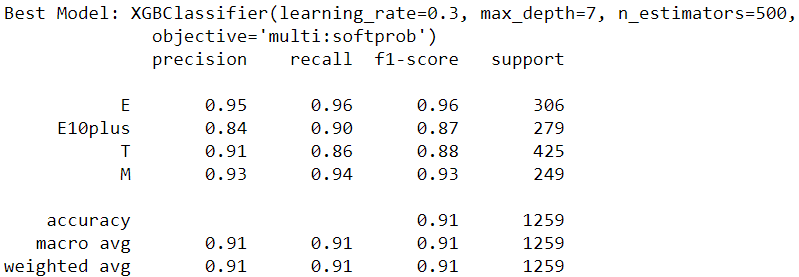

# Predicting ESRB Ratings for Video Games

## Introduction

The purpose of this project is to predict game ratings for PlayStation4, Xbox One, and Nintendo Switch games. The game data is gathered directly from the esrb.org website. By looking at the descriptors given to a game, I hope to be able to use a classification model to predict the given rating. I believe that this model will help to determine whether game ratings are 'fair,' or if there is some degree of ambiguity when a consumer consults the rating tag before deciding on a game purchase. In the modeling, I will look to maximize recall for M-rated games as well as accuracy across the board.


> Looking at the image above, we can see an example of and ESRB rating and its descriptors.


## Obtaining Data

The data for this project was obtained from esrb.org using the Selenium library. I originally attempted to gather the data with BeautifulSoup as I was more familiar with that library, but I ran into some issues with the ESRB site requiring client-side loading of assets with Java. BeautifulSoup was not equipped to handle this, but Selenium allows for client-side web scraping.

The process for scraping the data is detailed in the data_gathering.ipynb notebook within this repository.

After scraping the data, everything was compiled into a pandas DataFrame


## Scrubbing the Data

There really wasn't much scrubbing involved with this data. I just needed to pull the values out of the lists in the descriptors column so that I could one-hot encode each descriptor as a categorical variable.

```
descriptors_ohe = pd.get_dummies(df.descriptors.apply(pd.Series).stack()).sum(level=0)
df_ohe = pd.concat([df.drop(columns=['descriptors']), descriptors_ohe], axis=1)
```


Then we rearranged the new DataFrame into a more intuitive order.

```
cols = list(df_ohe)
rating_col = cols.pop(2)
cols.append(rating_col)
df_ohe = df_ohe.reindex(columns=cols)
```


## Exploring the Data

After doing a stratified 75/25 train/test split, I checked the balance of the data.


The imbalance wasn't too bad, and apparently SMOTE doesn't support categorical data, so I moved on.

I wanted to know which descriptors seemed most indicative, so I plotted each descriptor against its mean value for each rating. A higher mean value for a single rating in a single descriptor would show that that descriptor is indicative of that rating.


> This graph shows strong indications for 'Blood and Gore', 'Fantasy Violence', 'Intense Violence', 'Mild Fantasy Violence', 'No Descriptors', and 'Strong Language'.

## Modeling

I ran the data through a few different classifiers (DecisionTreeClassifier, RandomForestClassifier, KNeighborsClassifier, and SVC). Some quick scoring checks on those vanilla models indicated that the RandomForestClassifier was the best starting point.


The vanilla model gives and overall accuracy of 0.91 and a 0.93 recall for M-rated games. I tried a couple variations of GridSearchCV to try to fine-tune the hyperparameters of the Random Forest, but in most cases, the default values were the most effective, and our scores remained unchanged.


To try and get a little bit of a boost in the scores, I switched to the XGBoost Classifier. Its default values were not an imrovement on the Random Forest model, but with a couple tweaks from GridSearchCV, I was able to get a model with 0.91 accuracy and 0.94 recall on the test data.


## Interpreting Results



The XGBoost model gave the best scores, but all the tweaking gave minimal gains. What about the data is preventing better classification? I made a new DataFrame of miclassified games to try to find any anomalies.

```
training_with_preds = training_data.copy()
training_with_preds['prediction'] = grid_result.predict(X_train)

wrong_df = training_with_preds[training_with_preds['rating'] !=
                               training_with_preds['prediction']]
```

I found that in the training set, 267 games had been misclassified. I plotted the mean inclusion again to see what descriptors were common in misclassified games.


> 80% of misclassified M-rated games have the 'Blood' descriptor, and nearly 100% have the 'Violence' descriptor. Almost half of misclassified E10plus-rated games have the 'Suggestive Themes' descriptor.

This suggests to me that in spite of the ESRB using many different descriptors for games, they use some of them more frequently than they should. This relies on a potential buyer using the rating to determine how extreme the descriptors are rather than using the descriptors to determine how mature the content of them game is.

When looking only at misclassified game containing the 'Blood' or 'Violence' descriptor, the chart showed that most true M-rated games had the 'Blood' descriptor while most true T-rated games had the 'Blood and Gore' descriptor. Taking into account that 100% of these misclassified games had the 'Violence' descriptor, it suggests that the ESRB is applying content warnings and ratings inconsistently. Out of 177 games in the training set where 'Blood' and 'Violence' were the only descriptors present, 152 were correctly identified as being rated T, while 25 M-rated games were misclassified as T-ratings.


## Recommendations

After reviewing the results, I believe predictions could be improved if lesser-used descriptors were used more frequently (e.g. 'Intense Violence' or 'Mild Violence' in place of 'Violence' when appropriate). It would also be helpful if more descriptors were used. In the case I presented previously, where both T- and M-rated games had only 'Blood' and 'Violence' descriptors, and extra descriptor or two could act as something of a tie-breaker, helping the model to make a better prediction as well as helping the consumer understand more fully why a game has its given rating.

## Future work

In the future, I would like to approach this problem further by training a model to look at box art or screenshots of games to see if that adds a helpful degree of context in making predictions.